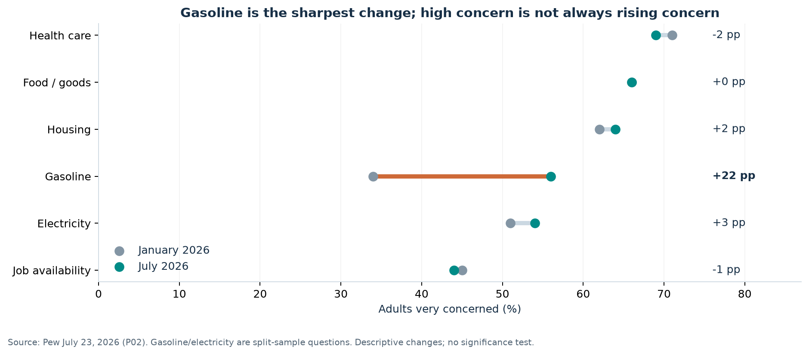
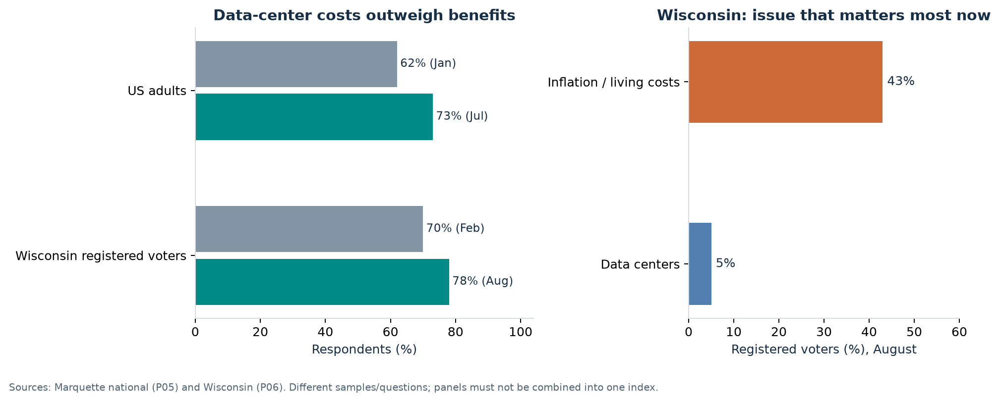
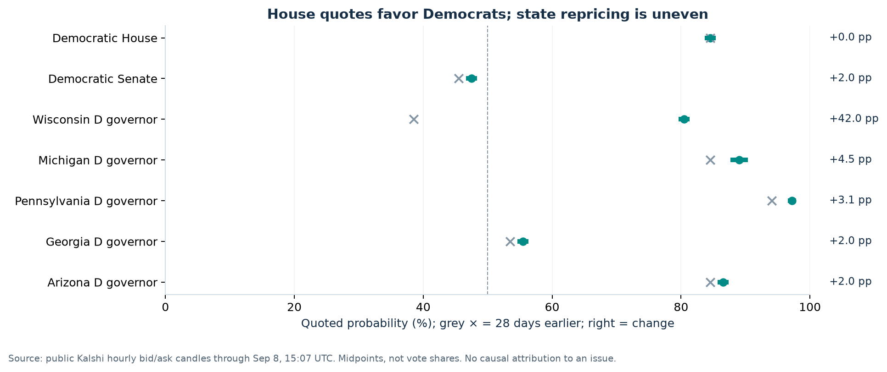
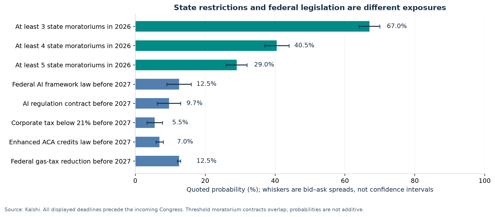
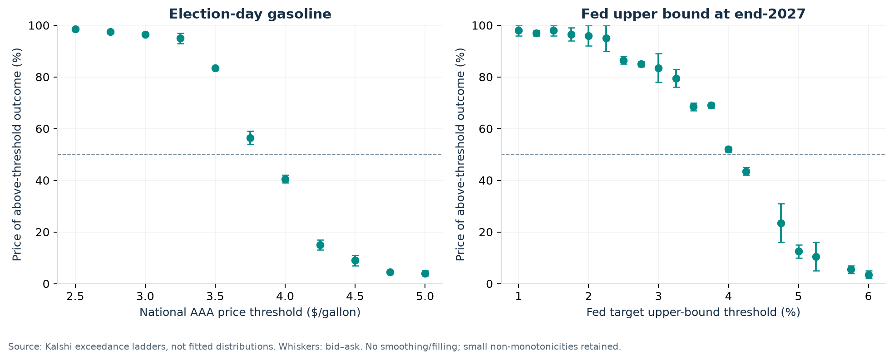
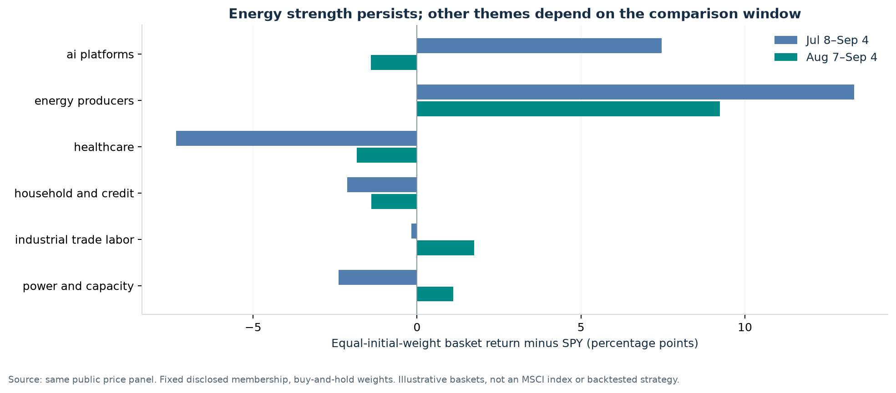
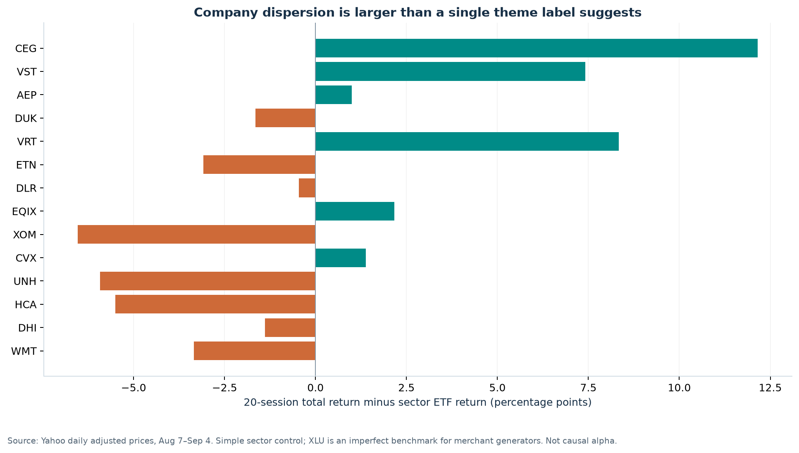
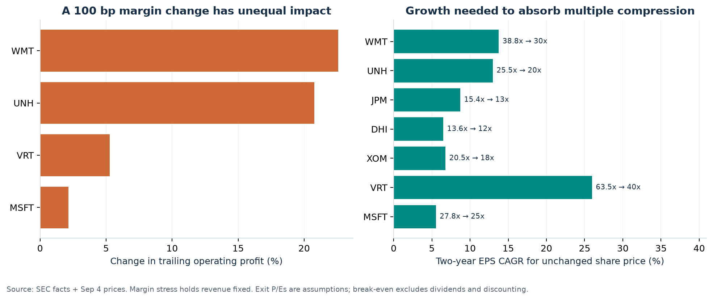
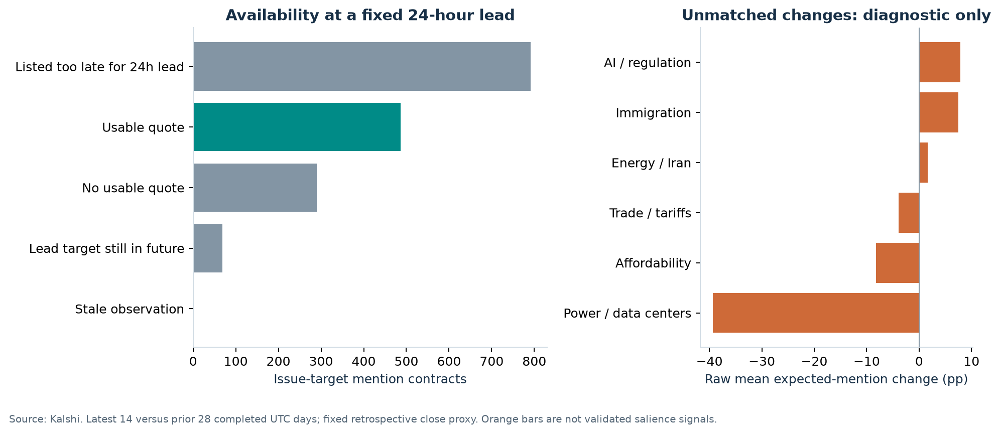

# US midterms: issue momentum, policy risk and equity opportunities

**A public-data investment study for a US long-only portfolio, with a 12–24 month horizon**

Kalshi cutoff: **2026-09-08T15:07:00Z**. Equity comparisons use completed US closes from **July 8 to September 4, 2026**. The September 8 partial session is excluded. Research compiled after the cutoff, using dated information available by that cutoff.

[Download the research workbook](Midterms_Research_Data.xlsx) · [PDF version](Midterms_Issue_Momentum_Research.pdf) · [Validation results](validation.json)

The strongest result is a change in **which businesses bear the cost of political responses**. Energy affordability and resistance to data-center development deserve attention, but they do not translate into a uniform pro-energy, anti-technology or pro-rate-cut equity trade. The evidence supports selective underwriting and risk reduction more strongly than a broad new thematic allocation.

| Investment conclusion | Evidence in this study | Immediate portfolio use |
|---|---|---|
| State implementation matters even if Washington is divided | The at-least-three-state moratorium contract is 67.0%, up +36.5 pp over 28 days; the federal AI-framework contract is 12.5% | Separate existing capacity, committed projects and speculative development in every power/AI holding |
| A Democratic House does not imply monetary easing | House-D is 84.5%; September +25 bp is 52.5%; end-2027 Fed upper bound above 3.75% is 69.0% | Stress rate-sensitive holdings without assuming an election-driven refinancing rescue |
| Energy protection already has an entry-price problem | Election-day gasoline above $4 is 40.5%, up +14.0 pp; XLE returned +15.2% against SPY +3.3% | Retain protection where needed, but test normalization downside before adding sector beta |
| Affordability can help customers while hurting suppliers' margins | Healthcare and household businesses have very different cost pass-through, funding and starting valuations | Underwrite reimbursement, incentives, trade-down and cash conversion separately |
| The apparent mentions signal largely fails a comparability test | 486 usable observations from 1,637 issue-target contracts; 1 supported cohort, no supported issue-wide trend | Use political-language markets as a research prompt, not an automatic trading signal |

These are **supported research conclusions and explicit investment judgments**, not evidence of causal election alpha. Relative returns show how securities have behaved; they do not establish how much of a particular political risk is already embedded in each valuation. The report makes that final connection through cash-flow mechanisms and transparent stress assumptions.

## 1. Which issues are actually gaining traction?

We distinguish four observable concepts: concern about an economic problem; opposition to a project or policy; the issue respondents prioritize; and the language traders expect a speaker to use. A change in one cannot be substituted for a change in another. This matters especially when a highly visible controversy is not voters' leading concern.

Gasoline concern has the clearest increase in the comparable national cost questions. Healthcare and housing remain prominent, but their changes do not establish a new acceleration. The July AI question lacks a January baseline, so it cannot support a January-to-July trend. [P02: Americans' evaluations of the economy remain negative](https://www.pewresearch.org/politics/2026/07/23/americans-evaluations-of-the-economy-remain-negative/)

There is also contrary evidence: Gallup's open-ended inflation-as-the-top-national-problem measure fell from 15% in May to 11% in July. That is a different question and time window, not a contradiction to be averaged away. A robust conclusion is **selective pressure around particular household costs**, rather than continuously rising concern across every affordability issue. [P03: U.S. Economic Confidence Improves in July](https://news.gallup.com/poll/713018/economic-confidence-improves-july.aspx)

Pew's separate election question puts the economy at the center of the agenda voters want congressional candidates to discuss. It measures campaign priorities rather than the general level of anxiety. Its national vote-preference results are not a forecast of House seats. [P01: As the 2026 midterms approach, economy is front and center](https://www.pewresearch.org/politics/2026/07/23/as-the-2026-midterms-approach-economy-is-front-and-center/)

National opposition to data centers increased on a comparable question. That supports treating the issue as a durable policy risk extending beyond a single locality. It does not itself establish a national voting swing. [P05: New Marquette Law School Poll national survey finds inflation and cost of living the most important issue; economy next most important](https://law.marquette.edu/poll/2026/08/05/new-marquette-law-school-poll-national-survey-finds-inflation-and-cost-of-living-the-most-important-issue-economy-next-most-important/)

Wisconsin illustrates the distinction: costs-outweigh-benefits responses reached 78%, yet only 5% selected data centers as the issue that matters most now, versus 43% for inflation and living costs. Opposition crosses party lines. This makes customer protection and permitting plausible campaign responses even when the issue does not lead respondents' stated priorities. [P06: Marquette Law Poll finds Crowley leading Tiffany among likely voters, tied among all registered voters](https://law.marquette.edu/poll/2026/08/26/marquette-law-poll-finds-crowley-leading-tiffany-among-likely-voters-tied-among-all-registered-voters/)

The investment implication is to focus on **the proposed remedy and the party that pays for it**. A moratorium delays capacity. A minimum bill reallocates stranded-asset risk. A permitting condition can change project timing without prohibiting development. These mechanisms have different effects on cloud platforms, generators, utilities, equipment vendors and landlords.

| Issue family | What the evidence supports | What it does not support | Equity question |
|---|---|---|---|
| Energy / gasoline | A large increase in cost concern, plus higher election-day gasoline odds | A calibrated probability of prolonged conflict | How much current profit depends on disruption rather than sustainable production? |
| Electricity / data centers | Rising opposition and actual state actions | A universal US construction ban or a clean vote effect | Who funds connections, delays and unused capacity? |
| AI / jobs / regulation | Concern varies by age; regulation is proceeding through different institutions | A broad rise in every AI attitude or a single federal regulatory outcome | Does cash generation justify infrastructure and compliance spending? |
| Healthcare | Costs are electorally important; preferred remedies differ by party | Automatic policy relief for insurers or hospitals | Which entities lose coverage, reimbursement or pricing flexibility? |
| Housing | Affordability remains a high concern | A new surge in concern or guaranteed mortgage-rate relief | Can orders improve without sacrificing margin through incentives? |
| Immigration / trade / fiscal | Important policy channels, with substantial implementation outside new legislation | A validated new attention trend in this short Kalshi sample | Where do labor, input costs, taxes and credit losses reach earnings? |

On healthcare, KFF finds different emphases across party groups: cost relief and program-fraud concerns are not the same policy mandate. On AI, the clearer attitude change is among younger adults; it is not evidence that they will turn out or vote differently. [P08: Poll: Costs Are the Top Health Care Issue for Voters in the Midterms, But Fraud Tops Republicans' List As Trump Administration Pushes Crackdown](https://www.kff.org/public-opinion/poll-costs-are-the-top-health-care-issue-for-voters-in-the-midterms-but-fraud-tops-republicans-list-as-trump-administration-pushes-crackdown/); [P07: Young adults in the U.S. are increasingly wary of AI, concerned it will take jobs](https://www.pewresearch.org/short-reads/2026/08/18/young-adults-in-the-us-are-increasingly-wary-of-ai-concerned-it-will-take-jobs/)

## 2. The election must be analyzed before the equity trade

The federal and state contests change different institutional levers. Congressional elections affect legislation, appropriations, oversight and, through Senate control, nominations. Governors and legislatures affect state implementation and regulatory appointments within their respective powers. The presidency continues through its ordinary term. Existing statutes, executive authority, courts and independent regulators remain relevant after November.

| Contract outcome | Midpoint | Spread | 28-day change |
| --- | --- | --- | --- |
| Democratic House | 84.5% | 1.0% | +0.0 pp |
| Democratic Senate | 47.5% | 1.0% | +2.0 pp |
| Wisconsin D governor | 80.5% | 1.0% | +42.0 pp |
| Michigan D governor | 89.0% | 2.0% | +4.5 pp |
| Pennsylvania D governor | 97.2% | 0.6% | +3.1 pp |
| Georgia D governor | 55.5% | 1.0% | +2.0 pp |
| Arizona D governor | 86.5% | 1.0% | +2.0 pp |

**The House market strongly favors Democrats; the Senate market is much closer.** The House-D quote changed little over the 28-day comparison, while Wisconsin-D moved +42.0 pp to 80.5%. This is a useful signal about where new political information has arrived. It does not prove that electricity or any other issue caused the repricing.

The Wisconsin comparison begins at 10:07 a.m. local time on August 11, its primary day, and crosses the first post-primary survey. Nomination resolution, the candidate matchup and turnout assumptions therefore contaminate a simple issue-event interpretation. The survey's likely-voter and registered-voter results also differ. An unchanged national House quote is a useful comparison, but it cannot remove those state-specific confounders. [E06: Notice of Election: Partisan Primary August 11, 2026 and General Election November 3, 2026](https://www.bayfieldcounty.wi.gov/DocumentCenter/View/20824/Notice-of-Election-Partisan-Primary-August-11-2026-and-General-Election-November-3-2026); [P06: Marquette Law Poll finds Crowley leading Tiffany among likely voters, tied among all registered voters](https://law.marquette.edu/poll/2026/08/26/marquette-law-poll-finds-crowley-leading-tiffany-among-likely-voters-tied-among-all-registered-voters/)

### Federal outcomes and their actual powers

The following are directly quoted **joint organizational-control contracts for February 2027**, rather than products of separate House and Senate probabilities. Their midpoint sum is slightly above 100%; they are not normalized into artificial scenario weights. Organizational control also has a different resolution basis from simply winning an election.

| February 2027 organization | Joint quote | Policy implications with Republican presidency |
| --- | --- | --- |
| R House / R Senate | 15.5% | Strongest route for Republican fiscal legislation; margins and procedure still matter. |
| D House / R Senate | 36.5% | House oversight and fiscal bargaining; Republican Senate retains nomination leverage. |
| R House / D Senate | 1.7% | Senate nomination and legislative constraints; House remains a fiscal gatekeeper. |
| D House / D Senate | 47.5% | Democratic legislative agendas and oversight; presidential veto remains a constraint. |

Ordinary legislation, nomination votes, cloture and reconciliation have different requirements. Neither a narrow majority nor control of both chambers means unlimited policy authority. A Democratic Congress still faces a Republican president; Republican legislative control still faces internal coalition and procedural constraints. Senate ties also require attention to actual organization and contract definitions. [E05: U.S. Senate: About Voting](https://www.senate.gov/about/powers-procedures/voting.htm); [E07: The Constitution of the United States: A Transcription](https://www.archives.gov/founding-docs/constitution-transcript)

### State outcomes: map authority, not just party

| State or mechanism | Election relevance | Implementation question for a company model |
|---|---|---|
| Wisconsin | Substantial state-race repricing across the primary; data-center opposition is broad | Which projects require future permits, public support or cost-allocation decisions? |
| Pennsylvania | A strongly favored incumbent can act before November | Do project consent agreements and local approvals change review or delivery timing? |
| Michigan | Multiple candidates make a simple two-party narrative incomplete | Which industrial, labor and utility exposures depend on state decisions rather than national control? |
| Georgia and Arizona | Competitive or materially exposed growth jurisdictions remain part of the watchlist | Can a project's economics survive either candidate's permitting and customer-protection conditions? |
| State legislatures and regulators | A governor alone does not determine the policy result | Are legislative consent, commission votes, courts or local approvals additional gates? |

The study screens a verified set of election market families; it is not a complete official model of every state legislative chamber. NCSL's election coverage helps distinguish the offices being contested from the powers assumed in an investment thesis. [E03: NCSL State Elections 2026](https://www.ncsl.org/elections-and-campaigns/ncsl-state-elections-2026)

**The actionable election distinction:** national legislative uncertainty may constrain broad tax or spending changes, while state permitting, tariffs for large electricity users and implementation of existing law can still affect 2027 earnings. A portfolio hedged only against House control can remain exposed to these outcomes.

## 3. Policy pricing: restrictions can advance without a sweeping federal law

| Contract outcome | Midpoint | Spread | 28-day change |
| --- | --- | --- | --- |
| At least 3 state moratoriums in 2026 | 67.0% | 6.0% | +36.5 pp |
| At least 4 state moratoriums in 2026 | 40.5% | 7.0% | +23.5 pp |
| At least 5 state moratoriums in 2026 | 29.0% | 6.0% | +17.0 pp |
| Federal AI framework law before 2027 | 12.5% | 7.0% | +1.5 pp |
| AI regulation contract before 2027 | 9.7% | 6.7% | -2.9 pp |
| Corporate tax below 21% before 2027 | 5.5% | 4.5% | -0.4 pp |
| Enhanced ACA credits law before 2027 | 7.0% | 2.1% | +1.2 pp |
| Federal gas-tax reduction before 2027 | 12.5% | 1.0% | -3.0 pp |

The contrast between 67.0% for at least three state moratoriums in 2026 and 12.5% for a federal AI framework is economically useful. It is not an arbitrage spread: the contracts describe different events, institutions and thresholds. Nor is a state-count contract a probability that a particular company's projects are affected. The count requires qualifying binding state-level moratoriums; Ohio tariffs and Pennsylvania permitting conditions do not automatically qualify.

The federal framework contract can qualify through specified voluntary federal-adoption guidelines as well as other provisions. It must not be described as a pure bet on mandatory private-sector regulation or federal preemption. Separate AI contracts also have different scopes. Read the actual rule before using any probability in an earnings scenario.

**Every policy deadline displayed here ends during 2026 or by January 1, 2027, before the incoming Congress convenes.** These prices describe near-term action under the existing institutional setting. They cannot stand in for the legislative capacity of the 2027–28 Congress. This is a material horizon gap for a 12–24 month equity investor.

### What has actually happened?

| Primary evidence | Verified stage | Economic interpretation |
|---|---|---|
| Ohio large-load tariff | Regulator order | Connection and unused-capacity risk can move toward the data-center customer |
| Pennsylvania August executive order | Signed permitting action; tariff advocacy directed | Sequencing and financing risk change; the order does not itself set all proposed utility tariffs |
| Maine moratorium proposal | Veto sustained; advisory council established | Political attention does not guarantee enactment |
| Colorado automated-decision law | Enacted; key obligations begin in January 2027 | Compliance timing can affect the investment horizon without a new federal law |
| White House AI framework | Legislative proposal | A policy preference, not an enacted national rule |

Sources: [S01: PUCO orders AEP Ohio to create data center specific tariff](https://content.govdelivery.com/accounts/OHPUC/bulletins/3e8bb79); [S02: Governor Mills Signs Executive Order to Establish Maine Data Center Advisory Council](https://www.maine.gov/governor/mills/news/governor-mills-signs-executive-order-establish-maine-data-center-advisory-council-2026-04-29); [S03: Executive Order 2026-05 – Protecting Pennsylvania Consumers from Data Center Impacts](https://www.pa.gov/content/dam/copapwp-pagov/en/governor/documents/eo2026_05_protecting%20pennsylvania%20consumers%20from%20data%20center%20impacts_final_executed.pdf); [S04: SB26-189 Automated Decision-Making Technology](https://leg.colorado.gov/bills/sb26-189); [S05: President Donald J. Trump Unveils National AI Legislative Framework](https://www.whitehouse.gov/releases/2026/03/president-donald-j-trump-unveils-national-ai-legislative-framework/).

Pennsylvania's order changes treatment of new applications for projects above 25 MW and removes data centers from Fast Track. It distinguishes participants in the state's agreement process from nonparticipants and preserves local approval requirements. Its instruction to advocate for particular cost-recovery tariffs is not the same as approving those tariffs. The correct model adjustment is project-specific timing and cost allocation, not a blanket ban. [S03: Executive Order 2026-05 – Protecting Pennsylvania Consumers from Data Center Impacts](https://www.pa.gov/content/dam/copapwp-pagov/en/governor/documents/eo2026_05_protecting%20pennsylvania%20consumers%20from%20data%20center%20impacts_final_executed.pdf)

Existing Medicaid implementation, housing actions, trade measures and business-interest rules likewise require their own dates and legal stages. A low probability of new legislation does not imply no change in companies' operating environment. [S06: Medicaid Program; Community Engagement Requirement for Certain Individuals](https://www.federalregister.gov/documents/2026/06/03/2026-11094/medicaid-program-community-engagement-requirement-for-certain-individuals); [S07: Fact Sheet: President Donald J. Trump Removes Regulatory Barriers to Affordable Home Construction](https://www.whitehouse.gov/fact-sheets/2026/03/fact-sheet-president-donald-j-trump-removes-regulatory-barriers-to-affordable-home-construction/); [S08: USTR Takes Action in Forced Labor Section 301 Investigations](https://www.ustr.gov/about/policy-offices/press-office/press-releases/2026/july/ustr-takes-action-forced-labor-section-301-investigations); [S09: Questions and Answers about the limitation on the deduction for business interest expense](https://www.irs.gov/pub/irs-drop/fs-2026-14.pdf)

## 4. Energy affordability and the Fed: the most consequential macro connection

The election-day gasoline-above-$4 contract moved to **40.5%**, a **+14.0 pp** increase in 28 days. September's exactly-25-bp hike contract is **52.5%**, up **+10.0 pp**. The end-2027 upper-bound-above-4% contract is **52.0%**. Together, these markets justify a serious higher-rate and household-cost stress case. Their marginal probabilities cannot identify the probability of a joint election–oil–Fed scenario.

The institutional baseline also matters: the July FOMC held the target range at 3.50–3.75%, with three voters preferring a 25-bp increase. The August employment release showed 162,000 additional payroll jobs and 4.1% unemployment. Those dated observations do not support treating immediate cuts as a mechanical consequence of electoral pressure. [M01: Federal Reserve issues FOMC statement](https://www.federalreserve.gov/newsevents/pressreleases/monetary20260729a.htm); [M02: Employment Situation News Release - August 2026](https://www.bls.gov/news.release/archives/empsit_09042026.htm)

The gasoline and Fed charts are **exceedance ladders**, not fitted probability distributions. Missing quotes and small non-monotonicities remain visible. The analysis does not extrapolate a precise expected rate, divide marginal probabilities to create conditional forecasts, or assume that a temporary energy shock has a permanent effect on inflation.

| 12–24 month scenario | Mechanism to test | Holdings most exposed | Portfolio response |
|---|---|---|---|
| Persistent energy pressure with resilient activity | Household purchasing power weakens while policy remains restrictive | Discretionary demand, leveraged real estate, incentive-dependent housing, long-duration growth | Raise earnings and financing stress requirements; retain selected energy protection |
| Energy normalizes, demand remains intact | Purchasing power improves and disinflation becomes more plausible | Consumer demand and some housing exposures benefit; producer windfalls fade | Reassess energy overweight; add cyclicals only after orders and margins confirm |
| Growth weakens enough to bring easing | Lower rates coexist with weaker sales, credit losses or occupancy | Banks, builders, industrials, landlords | Favor balance-sheet resilience; avoid assuming cuts solve the earnings problem |

EIA's August forecast provides a dated physical-supply scenario, with assumptions about Hormuz constraints and subsequent recovery. It is an external scenario, not a calibration target or a certainty; subsequent energy prices can disagree with it. [M05: Short-Term Energy Outlook - August 2026](https://www.eia.gov/outlooks/steo/archives/aug26.pdf)

For a global fundamental investor, the spillovers run through imported energy bills, the dollar, US end demand and delivery schedules for equipment. US project delays can defer overseas suppliers' revenue even if orders are not cancelled. Energy normalization can help importing economies while reducing producers' cash generation. These are transmission hypotheses; this report does not claim to have estimated non-US stock returns or currency hedges.

**Investment judgment:** use energy exposure as insurance against a defined portfolio vulnerability, with an explicit cost in the normalization scenario. Avoid adding a collection of REITs, utilities, housing and expensive growth stocks under the common assumption that a Democratic House guarantees easier money.

## 5. What equity prices reveal—and where they are insufficient

The energy-producer basket returned 16.65% over the common window, against SPY +3.3%. The energy ETF also advanced strongly. This is evidence that energy strength is visible in equity prices, not proof that the remaining shock is fully priced. A fresh overweight requires incremental cash-flow upside that exceeds the downside from normalization.

The other baskets are much less stable across time windows. The broad power/capacity group mixes regulated networks, merchant generation, equipment and real estate. Its aggregate return conceals the economic distinctions that matter most for stock selection.

| Stock | Jul 8–Sep 4 | 20 sessions | Sector ETF | 20-session excess |
| --- | --- | --- | --- | --- |
| CEG | +22.5% | +10.9% | XLU | +12.2 pp |
| VST | -3.6% | +6.2% | XLU | +7.4 pp |
| AEP | -7.7% | -0.2% | XLU | +1.0 pp |
| DUK | -4.3% | -2.9% | XLU | -1.6 pp |
| VRT | -11.7% | +3.0% | XLI | +8.3 pp |
| ETN | +3.1% | -8.4% | XLI | -3.1 pp |
| DLR | +6.9% | -2.8% | XLRE | -0.5 pp |
| EQIX | +2.5% | -0.2% | XLRE | +2.2 pp |
| XOM | +13.7% | +4.9% | XLE | -6.5 pp |
| CVX | +19.6% | +12.8% | XLE | +1.4 pp |
| UNH | -6.7% | -2.4% | XLV | -5.9 pp |
| HCA | -1.4% | -2.0% | XLV | -5.5 pp |
| DHI | -3.6% | -5.5% | XLY | -1.4 pp |
| WMT | -5.0% | -4.0% | XLP | -3.3 pp |

Returns are adjusted-price ratios. “Excess” is the stock return minus the stated sector ETF's return, in percentage points; it is not estimated alpha. For example, XLU is an imperfect control for merchant generators' commodity, contracting and asset exposures. Peer comparisons therefore supplement, rather than replace, company analysis.

### Four stock-selection conclusions

**1. Existing capacity and new construction should not share one risk label.** CEG returned +22.5% over the full window while VRT returned -11.7%. Scarce operating capacity can retain value even when new projects face delays, but this is a hypothesis about asset economics—not an attribution of those returns to moratorium news. Merchant generators also face power-price and demand risks; utilities face rate recovery and financing; equipment suppliers face order conversion and manufacturing utilization.

**2. “Buy the AI infrastructure dip” needs a valuation test.** Vertiv's strong reported operating growth and its share-price decline can coexist if investors had expected more. Its 63.5x trailing GAAP P/E remains demanding in a delay scenario. Microsoft, equipment vendors and data-center landlords also have different sources of profit and capital intensity. They should not be interchangeable expressions of an AI view.

**3. Healthcare weakness is selective.** UNH underperformed XLV by -12.3 pp over the common window. This is consistent with significant company or business-model concern already being reflected in prices. It does not establish cheapness. A broad healthcare allocation can behave differently from a payer/provider pair because policy, medical utilization and coverage changes affect each differently.

**4. Affordability beneficiaries can have expensive shares.** A retailer can gain customers trading down yet suffer input, wage or mix pressure. A builder can stimulate sales through incentives while reducing profit per home. A lower stock multiple can also reflect lower prospective earnings. The relevant unit of analysis is cash earned after providing the affordability relief.

The equity sample is 25 economically selected stocks plus 11 ETFs, not a comprehensive US security universe or an MSCI ACWI replication. No holdings data were used; portfolio exposures and exact trade sizes therefore remain outside the empirical claims.

## 6. Earnings and valuation: make the policy thesis pay its way

| Stock | Trailing P/E | Cash FCF yield | Assumed exit P/E | EPS CAGR for flat price |
| --- | --- | --- | --- | --- |
| MSFT | 27.8x | 1.8% | 25x | 5.5% |
| VRT | 63.5x | 2.7% | 40x | 26.0% |
| XOM | 20.5x | 4.7% | 18x | 6.8% |
| DHI | 13.6x | 8.0% | 12x | 6.5% |
| JPM | 15.4x | Unavailable | 13x | 8.7% |
| UNH | 25.5x | 6.6% | 20x | 13.0% |
| WMT | 38.8x | 1.6% | 30x | 13.8% |

Trailing P/E uses the September 4 price and a matching-period reconstructed EPS proxy. Annual plus current fiscal year-to-date minus prior year-to-date EPS is approximate when diluted share counts change. The cash FCF proxy is operating cash flow less cash purchases of property and equipment; it excludes finance-lease additions and acquisitions. Its yield uses the price times a dated reported share count. These are not forward consensus multiples, sustainable distributable yields or cross-sector fair-value rankings. Bank FCF is intentionally omitted. Raw tags, periods, units and filing accessions are in the workbook.

The exit multiples are **illustrative stress assumptions**. The right-hand chart solves: two-year EPS CAGR for a flat share price = square root of current P/E divided by assumed exit P/E, minus one. It excludes dividends and does not meet a required investment return merely by keeping the price flat.

At a 40x exit multiple, Vertiv needs **26.0% annual EPS growth for two years just to preserve its share price**. Even 25% annual EPS growth would produce approximately **-1.5%** price return under that assumption. Walmart needs **13.8%** annual growth to absorb a decline to 30x; 10% annual growth implies about **-6.5%** price return. These calculations explain why genuine operating beneficiaries may still be unattractive additions at a given price.

The margin chart holds revenue constant and applies a one-percentage-point change to consolidated operating margin. That is roughly **20.8%** of UNH's trailing operating profit and **22.6%** of Walmart's. It is not a forecast of a policy effect and must not be confused with a one-point medical-cost-ratio or tariff-rate change.

### Company cash-flow bridges

| Company / exposure | What must enter the model | Evidence or condition needed before adding |
|---|---|---|
| Microsoft | Infrastructure cash spending, leases, depreciation, power costs and utilization against revenue monetization | Capacity delivery and cash conversion support the growth assumption; normalize investment gains in EPS |
| Vertiv / equipment | Project timing, backlog conversion, pricing, inventory and factory absorption | Orders convert to cash under a delay case; valuation still meets the required return |
| AEP / regulated utilities | Customer guarantees, minimum bills, allowed recovery, financing and capital timing | Binding customer protection and commission decisions support returns on the new investment |
| Exxon / integrated energy | Upstream realizations, volumes, refining, working capital and distributions | Acceptable returns at normalized energy prices, rather than reliance on peak disruption earnings |
| D.R. Horton / housing | Buyer payments, cancellations, sales incentives, mix, land and inventory | Better demand translates into stable margins and cash rather than larger subsidies to buyers |
| JPMorgan / banks | Deposit pricing, loan growth, credit losses, fees and capital distributions | Rate assumptions survive both sticky inflation and weaker-credit scenarios |
| UnitedHealth / healthcare | Reimbursement, enrollment mix, utilization and administration | Margin stabilization and funding assumptions are supported independently of a hoped-for election outcome |
| Walmart / household spending | Trade-down volume, merchandise mix, imports, wages, logistics and higher-margin services | Incremental sales produce cash profit at a valuation that tolerates slower growth |

Microsoft's reported annual EPS includes an OpenAI investment gain, reinforcing the need to normalize the denominator. AEP's management guidance and load commitments are useful evidence, but the cached standardized financial feed trails a newer filing; the pipeline withholds its stale valuation inputs. D.R. Horton's reported cancellation and incentive commentary is more immediately relevant to margins than a generic rate-cut narrative. [Microsoft results](https://www.microsoft.com/en-us/investor/earnings/fy-2026-q4/press-release-webcast); [AEP results](https://www.aep.com/news/stories/view/12135/); [D.R. Horton results](https://investor.drhorton.com/news-and-events/press-releases/2026/07-21-2026-113055285).

The other primary operating checks are [Vertiv's results](https://www.sec.gov/Archives/edgar/data/1674101/000162828026050323/q22026exhibit991vrt07292026.htm), [Exxon's results](https://investor.exxonmobil.com/sec-filings/all-sec-filings/content/0002115436-26-000006/livef8k2q26991.htm), [JPMorgan's results](https://www.sec.gov/Archives/edgar/data/19617/000162828026048078/a2q26erfexhibit991narrative.htm), [UnitedHealth's results](https://www.unitedhealthgroup.com/newsroom/2026/2026-07-16-uhg-reports-second-quarter-2026-results.html) and [Walmart's results](https://stock.walmart.com/sec-filings/all-sec-filings/content/0000104169-26-000145/earningsreleasefy27q2.htm). Management's adjusted measures are kept distinct from the standardized GAAP calculations.

## 7. Portfolio decisions for the next 12–24 months

| Decision now | Research candidates | Why this follows from the evidence | What would change the decision |
|---|---|---|---|
| Preserve deliberate energy protection; do not chase the whole sector | XOM, CVX; review existing energy weights | Both political cost concern and energy repricing are visible; a new allocation must pay for normalization risk | Lower disruption risk and weaker normalized cash returns, or a more attractive hedge elsewhere |
| Disaggregate power exposure before adding capital | CEG/VST, AEP/DUK, ETN/VRT, DLR/EQIX | Regulation changes timing, cost recovery and asset scarcity differently | Project-level contracts and regulator decisions demonstrate protection or reveal cancellation/financing exposure |
| Require a stronger valuation cushion for execution-sensitive growth | VRT and other expensive capacity beneficiaries | Strong demand does not remove delivery risk or multiple-compression risk | Cash conversion and earnings growth can meet the required return under conservative exit multiples |
| Keep rate-sensitive additions conditional | DHI/LEN, HD, landlords, leveraged businesses | The Fed panel does not support assuming near-term cuts; easing can also accompany weaker demand | Mortgage payments, orders, cancellations and margins improve together |
| Treat healthcare weakness as a company-underwriting queue | UNH versus HCA and the wider sector | Concern about costs can lead to policies with opposing payer/provider effects | Reimbursement, coverage and utilization evidence supports an earnings recovery without speculative new relief |
| Price defensive demand separately from defensive valuation | WMT and other household essentials businesses | Traffic benefits can coexist with thin margins and a high entry multiple | Sustainable earnings growth and cash return justify the price after cost-pass-through stress |

These are actionable **allocation gates**: hold, trim an excessive exposure, defer new money, or advance a specific company to detailed underwriting. They are not unconditional buy/sell recommendations generated from a two-month return rank. DHI's 13.6x trailing P/E and 8.0% cash FCF yield, for example, merit examination of sustainable earnings and land cash flows; Walmart's 38.8x and 1.6% require a different growth and valuation hurdle.

### Risk management and hedging

For a long-only book, first reduce unintended concentration: a utility, a data-center landlord, a housing stock and an expensive growth stock may all depend on financing becoming cheaper even though they sit in different sectors. Review that common assumption using issuer cash flows and refinancing schedules. The sample here does not estimate the beta or risk contribution of the user's actual holdings.

If options are used, a broad-market or relevant sector put spread can be evaluated against the specific residual downside after trimming exposures. Premiums, strikes, expiries and liquidity have not been collected, so the report does not label any option cheap or recommend an unpriced structure. Prediction-market prices are research inputs; no prediction-market hedge or trade is required for these conclusions.

Separate three catalysts: the November election result; organization and policy bargaining in early 2027; and company execution over the following earnings seasons. A short-dated election hedge can expire before the material earnings consequence. Conversely, long-dated protection can be unnecessarily expensive when a position can be reduced directly.

## 8. The quantitative test that prevented a false theme signal

| Issue | Events: latest / prior | Raw change | Supported cohorts | Interpretation |
| --- | --- | --- | --- | --- |
| affordability inflation | 8 / 30 | -8.2 pp | 0 | Insufficient matched issue evidence |
| energy iran | 9 / 35 | +1.7 pp | 1 | Insufficient matched issue evidence |
| electricity datacenters | 3 / 7 | -39.4 pp | 0 | Insufficient matched issue evidence |
| ai jobs regulation | 16 / 57 | +7.9 pp | 0 | Insufficient matched issue evidence |
| healthcare | 2 / 11 | Unavailable | 0 | Insufficient matched issue evidence |
| housing | 1 / 1 | Unavailable | 0 | Insufficient matched issue evidence |
| immigration | 4 / 9 | +7.5 pp | 0 | Insufficient matched issue evidence |
| trade tariffs | 13 / 41 | -4.0 pp | 0 | Insufficient matched issue evidence |
| taxes fiscal | 2 / 10 | Unavailable | 0 | Insufficient matched issue evidence |
| jobs growth | 0 / 5 | Unavailable | 0 | Insufficient matched issue evidence |
| fed rates | 0 / 0 | Unavailable | 0 | Insufficient matched issue evidence |

Raw average expected-language prices suggest different movements across topics, including a positive AI change and a large negative data-center change. Those averages compare different listed phrases, speakers and events. The contrast with public data-center opposition is a warning about the measurement process, not evidence that voters or traders are irrational.

The matched test requires the same series, extracted speaker/company and normalized literal target, with at least three distinct events in both periods. It uses quotes at a fixed 24-hour lead to an event-close proxy, and requires at least two supported cohorts before describing an issue-wide trend. **791 contracts were listed too late for that lead.** Quarterly earnings calls also provide little repetition for a two-month within-company comparison.

Only one cohort qualifies: Trump's “oil / gas / gasoline” target, with three recent events versus seven prior events. Its mean quote changes from 68.43% to 67.50%, or approximately −0.93 percentage points. This remains the only supported cohort at 5-, 10- and 25-percentage-point spread limits. It is a narrow expected-language comparison, not a significant fall in energy salience.

The close anchor is retrospective and is not a verified scheduled speech start. Even the surviving comparison is therefore descriptive rather than a deployable historical trading signal. The code preserves the limitation instead of choosing a more favorable lead time after seeing the result.

### What participation data can and cannot say

Hourly volume is a flow; open interest is an outstanding-contract stock. The pipeline aggregates volume over observed intervals and uses the last observed OI per contract per day. It never adds hourly OI together as though it were new money. Issue overlap and changing contract coverage make cross-issue totals nonadditive.

Increasing OI is not proof that investors are collectively long an issue: each outstanding contract has opposing sides. Public data also do not reveal complete trader portfolios, historical large positions or equity-fund crowding. An orderbook or an isolated large trade would not solve that identification problem. Accordingly, the report describes **participation and prices**, not institutional positioning. [Kalshi public trades documentation](https://docs.kalshi.com/api-reference/market/get-trades); [authenticated positions documentation](https://docs.kalshi.com/api-reference/portfolio/get-positions).

The useful operating rule is to escalate a theme only when distinct evidence strengthens together: comparable public concern or priority, electoral relevance, a feasible policy mechanism, and material company cash-flow exposure. A price move can then establish that markets noticed something; a valuation model is still needed to decide whether the remaining opportunity is attractive.

## 9. Data coverage, methods and validation

The completed API census contains **532,847 eligible or unresolved-candidate records** across the broad category union. Website category membership is approximated from public API metadata; exact historical membership of all 33 requested web paths cannot be proven. After the dated/topic/geographic screen, **61,018** records enter the classified research inventory.

The implemented study uses an explicit **6,032-contract cohort**: all classified mention, election and policy contracts, plus named macro families selected for the research question. High-frequency oil-direction ladders are retained in the broader extraction, rather than allowed to dominate an electoral-attention measure simply because they list frequently. The scope configuration and exclusions are reproducible.

| Channel | Contracts | With cache | With bars | Hourly rows |
| --- | --- | --- | --- | --- |
| election | 1228 | 1228 | 1208 | 443376 |
| macro | 2249 | 2249 | 1867 | 558592 |
| mention | 1637 | 1637 | 1039 | 88479 |
| policy | 918 | 918 | 742 | 186462 |

All research-cohort contracts have collection artifacts, with no artifact or read errors. **4,856** contain hourly observations, totaling **1,276,909** retained rows. **1,176** have no hourly observations in the common study window; 1,108 of those settled before the window began. The remaining 68 returned empty histories and mostly have missing settlement timestamps or close times before the window; their timing and availability remain explicit limitations. Empty or unusable observations are not filled with zero prices. Older pre-settlement histories remain a separate dataset and do not enter these totals or current-period trends.

**The broader full-category historical extraction and its separate pre-settlement extension remain ongoing.** This report's completed research cohort is not a claim that every requested category's historical Excel export has finished. Older-settlement histories are a separate dataset and are not mixed into the current-period trend comparisons.

| Processing stage | Implemented rule | Why it matters |
|---|---|---|
| Universe | Full metadata scan, explicit taxonomy, frozen creation/open cutoff and named macro scope | Avoids selecting only attractive examples or counting trading-clock supply as salience |
| Prices | Dollar normalization by source/field; stated face value; valid two-sided midpoint | Avoids cents/dollars errors and last-trade artifacts |
| Quote quality | Crossed/out-of-range quotes excluded; 25 pp maximum spread with 5/10 pp mention sensitivity; maximum bar age 24h | Makes sparse and expensive quotes visible; bar age does not reveal actual quote-update age |
| Time | Common July 8–September 8 window; UTC completed-day aggregates; frozen Kalshi timestamp; completed US equity sessions | Prevents intraday/full-day and future-information mixing |
| Comparability | Same contract for 7/14/28-day price changes; same subject/phrase/event family for mentions | Avoids interpreting threshold, speaker or listing changes as an economic trend |
| Equity returns | Adjusted-close ratios, full/5/20-session windows, disclosed sector ETFs and fixed illustrative baskets | Provides simple controls and exposes sensitivity to the chosen window |
| Financials | Dated filings, matching fiscal periods/tags, stale-value withholding, explicit entity continuity | Avoids combining unrelated periods or treating missing data as zero |
| Reproducibility | Frozen input copies, source URLs, configuration/source hashes, regression tests and offline report build | Makes the conclusions and calculations reviewable |

The equity panel contains 1,548 daily prices for 36 securities over 43 dates; all declared members have complete price coverage. Current vendor-adjusted history is not a point-in-time archive. The SEC pipeline withholds stale AEP, debt or cash fields; it also handles Exxon's documented successor entity rather than dropping the June results or silently combining unrelated issuers. Missing standardized metrics are retained as gaps.

Validation includes duplicate checks, date boundaries, quote bounds, source/cutoff cache compatibility, numerical Excel types, formula-safe text, matched-cohort requirements and stale financial-fact handling. Source figures and selected return calculations were independently checked; charts were inspected for readability and definitions. The workbook includes original figure inputs, the full equity-return table, financial records and the public evidence register.

No regression claims a causal effect of elections on stocks, no significance search selects the best-looking issue, and no short-window pattern is presented as out-of-sample alpha. Unmeasured earnings news, commodity changes, factor exposures and company events remain important alternative explanations. Those limits make the appropriate outputs a disciplined stock-selection queue, valuation gates and explicit downside cases.

## 10. Sources and reproducibility

Primary evidence is manually coded with dates, question paraphrases, populations, policy stages, uncertainty notes and links to the original source materials. The registry retains contrary evidence and non-comparable series. The source list below supports the public-policy and election portions; company filings and price provenance are preserved in the input files and workbook.

- **P01 — 2026-07-23.** [As the 2026 midterms approach, economy is front and center](https://www.pewresearch.org/politics/2026/07/23/as-the-2026-midterms-approach-economy-is-front-and-center/)

- **P02 — 2026-07-23.** [Americans' evaluations of the economy remain negative](https://www.pewresearch.org/politics/2026/07/23/americans-evaluations-of-the-economy-remain-negative/)

- **P03 — 2026-07-27.** [U.S. Economic Confidence Improves in July](https://news.gallup.com/poll/713018/economic-confidence-improves-july.aspx)

- **P04 — 2026-04-28.** [Affordability Dominates Americans' Financial Worries](https://news.gallup.com/poll/708905/affordability-dominates-americans-financial-worries.aspx)

- **P05 — 2026-08-05.** [New Marquette Law School Poll national survey finds inflation and cost of living the most important issue; economy next most important](https://law.marquette.edu/poll/2026/08/05/new-marquette-law-school-poll-national-survey-finds-inflation-and-cost-of-living-the-most-important-issue-economy-next-most-important/)

- **P06 — 2026-08-26.** [Marquette Law Poll finds Crowley leading Tiffany among likely voters, tied among all registered voters](https://law.marquette.edu/poll/2026/08/26/marquette-law-poll-finds-crowley-leading-tiffany-among-likely-voters-tied-among-all-registered-voters/)

- **P07 — 2026-08-18.** [Young adults in the U.S. are increasingly wary of AI, concerned it will take jobs](https://www.pewresearch.org/short-reads/2026/08/18/young-adults-in-the-us-are-increasingly-wary-of-ai-concerned-it-will-take-jobs/)

- **P08 — 2026-07-16.** [Poll: Costs Are the Top Health Care Issue for Voters in the Midterms, But Fraud Tops Republicans' List As Trump Administration Pushes Crackdown](https://www.kff.org/public-opinion/poll-costs-are-the-top-health-care-issue-for-voters-in-the-midterms-but-fraud-tops-republicans-list-as-trump-administration-pushes-crackdown/)

- **S01 — 2025-07-09.** [PUCO orders AEP Ohio to create data center specific tariff](https://content.govdelivery.com/accounts/OHPUC/bulletins/3e8bb79)

- **S02 — 2026-04-29.** [Governor Mills Signs Executive Order to Establish Maine Data Center Advisory Council](https://www.maine.gov/governor/mills/news/governor-mills-signs-executive-order-establish-maine-data-center-advisory-council-2026-04-29)

- **S03 — 2026-08-18.** [Executive Order 2026-05 – Protecting Pennsylvania Consumers from Data Center Impacts](https://www.pa.gov/content/dam/copapwp-pagov/en/governor/documents/eo2026_05_protecting%20pennsylvania%20consumers%20from%20data%20center%20impacts_final_executed.pdf)

- **S04 — 2026-05-14.** [SB26-189 Automated Decision-Making Technology](https://leg.colorado.gov/bills/sb26-189)

- **S05 — 2026-03-20.** [President Donald J. Trump Unveils National AI Legislative Framework](https://www.whitehouse.gov/releases/2026/03/president-donald-j-trump-unveils-national-ai-legislative-framework/)

- **S06 — 2026-06-03.** [Medicaid Program; Community Engagement Requirement for Certain Individuals](https://www.federalregister.gov/documents/2026/06/03/2026-11094/medicaid-program-community-engagement-requirement-for-certain-individuals)

- **S07 — 2026-03-13.** [Fact Sheet: President Donald J. Trump Removes Regulatory Barriers to Affordable Home Construction](https://www.whitehouse.gov/fact-sheets/2026/03/fact-sheet-president-donald-j-trump-removes-regulatory-barriers-to-affordable-home-construction/)

- **S08 — 2026-07-23.** [USTR Takes Action in Forced Labor Section 301 Investigations](https://www.ustr.gov/about/policy-offices/press-office/press-releases/2026/july/ustr-takes-action-forced-labor-section-301-investigations)

- **S09 — 2026-08-19.** [Questions and Answers about the limitation on the deduction for business interest expense](https://www.irs.gov/pub/irs-drop/fs-2026-14.pdf)

- **M01 — 2026-07-29.** [Federal Reserve issues FOMC statement](https://www.federalreserve.gov/newsevents/pressreleases/monetary20260729a.htm)

- **M02 — 2026-09-04.** [Employment Situation News Release - August 2026](https://www.bls.gov/news.release/archives/empsit_09042026.htm)

- **M03 — 2026-05-19.** [Labor Force Characteristics of Foreign-born Workers - 2025](https://www.bls.gov/news.release/archives/forbrn_05192026.htm)

- **M04 — 2026-02-11.** [The Budget and Economic Outlook: 2026 to 2036](https://www.cbo.gov/publication/61882)

- **M05 — 2026-08-11.** [Short-Term Energy Outlook - August 2026](https://www.eia.gov/outlooks/steo/archives/aug26.pdf)

- **E01 — 2026-05-18.** [2026 Congressional Primary Dates and Candidate Filing Deadlines for Ballot Access](https://www.fec.gov/resources/cms-content/documents/2026pdates.pdf)

- **E02 — 2026-07-14.** [Senate Facts - 119th Congress party lineup](https://www.dailypress.senate.gov/on-the-floor/senate-facts/)

- **E03 — 2026-06-25.** [NCSL State Elections 2026](https://www.ncsl.org/elections-and-campaigns/ncsl-state-elections-2026)

- **E04 — 2026-08-03.** [Highlights from the 2026 NGA Summer Meeting](https://www.nga.org/news/press-releases/highlights-from-the-2026-nga-summer-meeting/)

- **E05 — Standing institutional reference.** [U.S. Senate: About Voting](https://www.senate.gov/about/powers-procedures/voting.htm)

- **E06 — 2026-04-09.** [Notice of Election: Partisan Primary August 11, 2026 and General Election November 3, 2026](https://www.bayfieldcounty.wi.gov/DocumentCenter/View/20824/Notice-of-Election-Partisan-Primary-August-11-2026-and-General-Election-November-3-2026)

- **E07 — Standing institutional reference.** [The Constitution of the United States: A Transcription](https://www.archives.gov/founding-docs/constitution-transcript)

**Kalshi:** public metadata and hourly/daily candle endpoints. The input snapshots retain exact tickers and resolution language; selected exhibits are in `tables/election_watchlist.csv`, `tables/policy_watchlist.csv`, and the gas/Fed ladder tables. Bid–ask widths are spreads, not statistical confidence intervals. No private account endpoints are required.

**Equities and company financials:** public Yahoo chart responses, SEC companyfacts/submissions and the linked company releases. The raw caches remain in the local data directory; the compact report input snapshot permits offline chart/table/report reproduction.

**Code:** `pmresearch.issue_research`, `pmresearch.equity_research`, `pmresearch.research_report`, and the collection, cohort-selection and report scripts. See the repository's midterm research runbook for commands, data definitions and the distinction between a fresh extraction and an offline rebuild.
